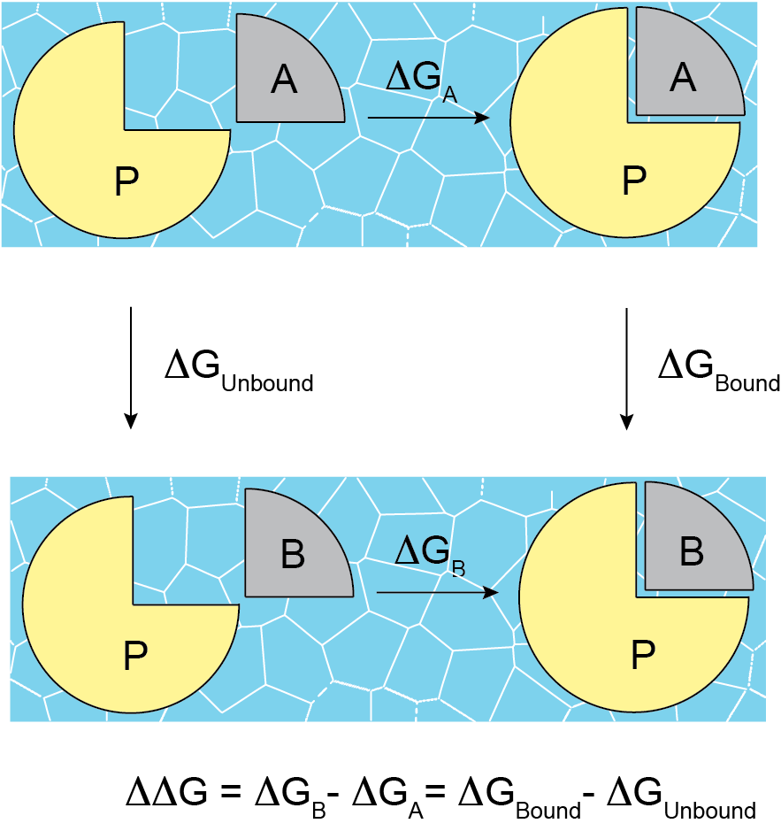
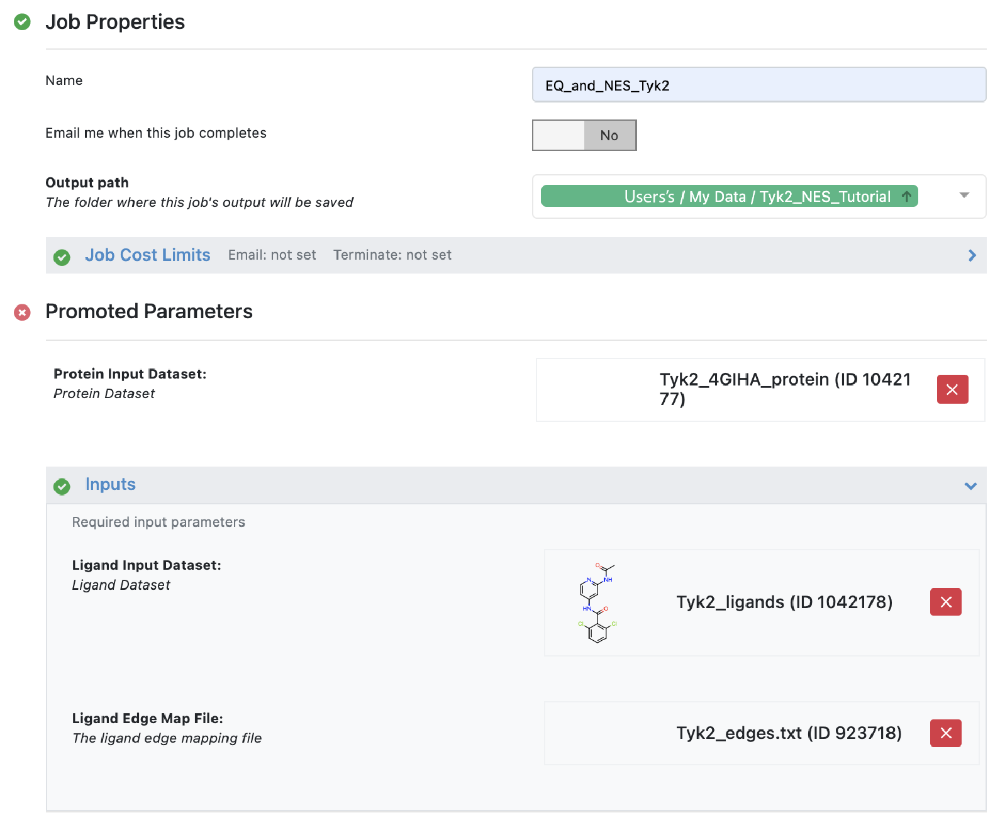

.. |A|         replace:: Å

#############
Tutorials
#############

These are tutorials for how to use specific floes.

Short Trajectory MD with Analysis
=================================

The Floe *Short Trajectory MD with Analysis* (STMD) is for pose validation.
You should start with a ligand with one or more conformers already well posed
in the active site, with protein-ligand interactions in place, serving as
hypotheses for ligand binding.
Each pose will be evaluated by this floe to be validated (or not) as a good pose.
We are not primarily asking the question "what is the pose for this ligand?"
but rather "is this a good pose for this ligand?", or with multiple poses,
"which of these poses is best?". We seek an answer by running a
short MD trajectory on each pose separately and comparing the results to the
starting (input) pose and between the poses (if more than one).

What this Floe does
-------------------
The structure of the STMD floe is shown in figure
`Structure of the STMD floe`.
Given the inputs of the protein and posed ligands,
the complex is formed with each ligand/conformer separately,
and the complex is solvated and parametrized according to
the selected force fields.
We refer to this ready-to-run molecular assembly as a "flask"
by analogy to experiment: all the components are combined into
the flask, upon which we run our experiment.
A minimization stage is performed on the flask followed by
a warm up (NVT ensemble) and several equilibration stages (NPT ensemble).
In the minimization, warm up, and equilibration stages,
positional harmonic restraints are applied on the ligand and protein.
At the end of the equilibration stages a short (default 2ns) production run
is performed on the unrestrained flask.
The production run is then analyzed in terms of interactions between
the ligand and the active site and in terms of ligand RMSD,
after fitting the trajectory based on active site C_alphas.

.. figure_STMD_floe:

.. figure:: ./images/STMD_floe.png
   :width: 800px
   :align: center
   :alt: Structure of the STMD floe

   **Structure of the STMD floe**

Ligand Input
------------

Just to be able to run, this floe requires ligands to have
reasonable 3D coordinates, all atoms, and correct chemistry
(in particular bond orders and formal charges).
If the ligands already have good atomic partial charges
(we recommend RESP or AM1-BCC_ELF10 charges),
we recommend using these for STMD as opposed to re-charging
them in the STMD floe.
Given that this floe only runs a very short timescale (default 2 ns),
it is preferable that the input pose be well refined.
Although bad clashes
(or poor positioning for interactions which you know are important)
can be (and often are) cleaned up by even this short trajectory,
it starts off the "evaluation" purpose of the floe on the wrong foot
by giving a poor comparator.
Poor initial poses might even be considered outside the scope of this floe
given how short is the default timescale.
This is why we **strongly recommend** that docked poses be
subsequently minimized in the active site **before input to STMD**.
This will resolve high gradients
(usually clashes) with the protein and to allow protein-ligand
interactions to optimize in the context of a good force field.
It is possible that even with this pre-MD refinement,
the docked-pose starting points could be re-evaluated and
triaged prior to the extra effort and expense of STMD.
The ligand input datasets used in this tutorial are:

    * :download:`MCL1_1poseLig35_elf10.oeb <files/MCL1_1poseLig35_elf10.oeb>`
    * :download:`MCL1_6poseLig35_elf10.oeb <files/MCL1_6poseLig35_elf10.oeb>`

Protein Input
------------
All the MD floes require correctly prepared protein up to "MD ready" standards.
This begins with the normal prerequisites for physics-based modeling:
protein chains must be capped,
all atoms in protein residues (including hydrogens) must be present, and missing
protein loops resolved or capped.
Of course, protein side chain formal charges and protonation
at this point determine their tautomeric state.
Additionally, cofactors and structured internal waters are also important to include,
not only those in the immediate vicinity of the ligand and active site
but also distally because they can have an important effect on the
protein structure and dynamics over the course of the MD.
We **strongly recommend** using *Spruce* for protein preparation.
The protein input dataset used in this tutorial is:

    * :download:`MCL1_SchrodingerFEP_4HW3A_extprot_v2.oeb.gz <files/MCL1_SchrodingerFEP_4HW3A_extprot_v2.oeb.gz>`

.. warning::

   Unfortunately, proteins with covalently bound ligands or covalently bound cofactors are currently not tractable

How to use this floe
--------------------

After selecting the *Short Trajectory MD with Analysis* floe in the Orion UI,
you will be presented with a job form with parameters to select.
In Figure `STMD Job Form for ligand 35 (6 poses)` you can see how we filled out
the key fields of that form for the ligand 35 6-pose case described below.

.. figure_STMD_jobForm:

.. figure:: ./images/STMD_jobForm_6poses.png
   :width: 800px
   :align: center
   :alt: STMD Job Form for ligand 35 (6 poses)

   **Key fields of STMD Job Form for ligand 35 (6 poses)**

Aside from the essential user-defined parameters relating to jobname,
input (protein and ligand datasets as described above), and
output (output and failure dataset names),
all other parameters have defaults preset to values that
we feel are suitable for the non-expert MD user
(or expert user for that matter) so launching the floe at this point is reasonable.
That said, some of the other top-level parameters are worth considering:

    * Flask_title (no default): Here is where you can put a handy short name for the protein to use in molecule titles (e.g. "Bace" instead of "beta-secretase").

    * Charge_ligands (default *True*): If your input ligands already have good atomic partial charges (e.g. `RESP` or `AM1-BCC_ELF10`), set this to *False* to have the floe use the existing ligand charges.

    * Ligand_forcefield (default *OpenFF1.2*): This forcefield choice has a strong impact on the results. We recommend the most recent version of the OpenFF force field from the *Open Force Field Initiative*.

    * Md_engine (default *OpenMM*): Gromacs is the other alternative but we recommend OpenMM because HMR works with it but not with Gromacs.

    * Hmr: Hydrogen Mass Repartitioning (HMR) gives a two-fold speedup and reduces cost. We recommend leaving it on.

We make the other top-level parameters available for expert users.

Accessing and Understanding the Results
---------------------------------------

The results from the STMD floe are accessed via two main avenues:
through the job output in the `Jobs` tab in Orion's `Floe` page, and
through orion's `Analyze` page.
We will look at the results of two jobs run on
the same MCL1 ligand; in the first case the input ligand had only a
single pose and in the second case it had six slightly different poses.

MCL1 ligand 35: single input pose
---------------------------------
First we will look at the results of the single-pose run.
In the `Jobs` tab in Orion's `Floe` page,
having selected the job name for your STMD job, you should land on
the job results page.
The left panel contains the usual orion job information from the run,
and the right panel has two tabs at the top if the run was not successful
or three tabs at the top if it was... we will focus on success here!
Selecting the third tab called *FLOE REPORT* should give you a
page looking similar to Figure `STMD Job results page for a single pose of an MCL1 ligand`.

.. figure_STMD_lig35_jobResults1pose:

.. figure:: ./images/STMD_JobResults_1pose.png
   :width: 1000px
   :align: center
   :alt: STMD Job results page for a single pose of an MCL1 ligand

   **STMD Job results page for a single pose of an MCL1 ligand**

The floe report shows a tile for each MD simulation, here there was
only one ligand in the input file.
The atom colors correspond to calculated B-factors, similar to Xray
B-factors, depicting the mobility of those atoms in the active site
over the course of the MD trajectory.
This gives an immediate read-out on how much various fragments of
the ligand were moving around in the active site. As a general principle
greater movement suggests that that fragment is not as tightly bound
in the active site, but inferences are only qualitative. Certainly
fragments hanging out in water of even a tightly bound inhibitor will be expected
to be more mobile than the buried parts.
Other information on each tile is:

    * The ligand name.

    * The number of clusters formed by clustering the ligand positions in the MD trajectory.

    * The Boltzmann-weighted MMPBSA score for ligand binding over the trajectories for all poses.

Clicking on the tile drills down into the detailed analysis of that simulation,
resulting in Figure `Detailed results for ligand 35 (single pose)`:

.. figure_STMD_lig35_interactiveSVG1pose:

.. figure:: ./images/STMD_interactiveSVG_1pose.png
   :width: 1000px
   :align: center
   :alt: Detailed results for ligand 35 (single pose)

   **Detailed results for ligand 35 (single pose)**

In the graphic we see a 2D representation of the ligand binding
interactions for the whole trajectory, with the default display
of the `Overall` tab at the top of the graphic. It is an interactive
graphic: selecting the `Cluster 0` tab in blue or the `Cluster 1` tab
in green will change the binding
interaction representation to that corresponding to the selected cluster.
Hovering over one of the interaction in the diagram lights up a
strip chart on the right-hand side grey arrow showing the occupancy
of that interaction over the course of the trajectory.
Within the heavy frame of the graphic, we see that the interactive
graph is on `interactions`; selecting `torsions` changes the depiction
to show a heavy black dot in each rotatable bond. Hovering over one
of these shows a radial bar graph of the occupancy of the torsion on
the right-hand side. Selecting `B-factor` yields a depiction of the
calculated B-factors for the selected cluster as in the parent tile,
but additionally shows the calculated B-factor for each active site
amino acid close to the ligand. To the right of the graphic is
information about the clustering of the ligand trajectory, including
a table giving the ensemble average MMPBSA energy (with standard error)
for each cluster. These averages are used to compute the Boltzmann-weighted
average for the ligand as a whole. Note that cluster 1 (green), the low
occupancy cluster, is much less stable than cluster 0 (blue), so the
Boltzmann-weighted result represents cluster 0 completely.

Scrolling down exposes a strip chart and two tables detailing relevant
analyses of the trajectories for all poses of the ligand.
The strip chart for ligand 35 (single pose) is shown
in Figure `Strip Chart results for ligand 35 (single pose)`:

.. figure_STMD_lig35_stripChart1pose:

   **Strip Chart results for ligand 35 (single pose)**

The strip chart shows a time course over the MD trajectory,
maintaining always the same color scheme as in the interactive graphic:
blue and green for cluster 0 and 1, respectively.
Additionally, cluster outliers, which are ligand configurations
that do not belong to any cluster, are shown in black.
The chart simply shows the cluster occupancy of each frame,
telling us that the trajectory started out in the blue Cluster 0,
then transitioned to the green Cluster 1 late in the trajectory.
From this sampling, it appears Cluster 0 is the predominant and
preferred cluster.

The two tables below the strip chart, shown in
`Cluster/Pose information for ligand 35 (single pose)`
describe a relationship
between each cluster found in the MD for the ligand and the
starting poses.

.. figure_STMD_lig35_tables1pose:

   **Cluster/Pose information for ligand 35 (single pose)**

With only one pose used for this run the tables
are terse, but below when we look at 6 input poses for the
same ligand they will be more informative. The upper table
"Cluster Percentage by Starting Pose" simply describes the
occupancy that we see in the strip chart: the ligand spends
71% of its time in cluster 0 and 8% in cluster 1. The second
table describes how closely each cluster stays to the
starting pose: the blue Cluster 0 sticks closely
to the initial pose (1.13 |A| RMSD), whereas the green Cluster 0
has moved somewhat farther away ( 2.72 |A| RMSD).
This tells us the predominant and preferred blue Cluster 0
stays close to the initial pose.

MCL1 ligand 35: 6 input poses
-----------------------------
Now we will look at the results of another run on the same ligand 35,
but this time with 6 different input poses: 3 related poses with the
methyl "up" in the upper panel of Figure `Input poses for the 6-pose run` and
3 related poses with the methyl "down" in lower panel of the same Figure.
The "up" and "down" poses are only differentiated in the Figure for
clarity; in the input file all 6 poses are together as the 6 conformers
of the ligand 35 molecule. Poses 0, 3, and 5 have the methyl "down" and
poses 1, 2, and 4 have the methyl "up"... this will be important later.
The question we might be asking here is whether
the "up" methyl or "down" methyl is preferred, and which of the input
poses (if any) is preferred. And of course we want to see if the
preferred cluster by MD still retains the binding interactions we
thought were good enough to carry ligand 35 along up to this point.

.. figure_STMD_lig35_input6poses:

.. figure:: ./images/Start3Pose_MeDown.png
   :width: 1000px
   :align: center
   :alt: Input poses for the 6-pose run

   **Input poses for the 6-pose run: 3 with the methyl "up" (top) and 3 with the methyl "down" (bottom)**

Once the run is completed, again we go to the job results page,
not shown here because it is so similar to what we saw with the single-pose example
in Figure  `STMD Job results page for a single pose of an MCL1 ligand` (above).
Selecting the third tab ("*FLOE REPORT*"),
there is still only a single tile for the single ligand; the results
for all 6 poses have been aggregated and analyzed together for that
ligand.
The atom colors corresponding to the calculated B-factors will often
be a lot "hotter" (more red) for multiple-pose inputs because trajectories
for diverse poses are aggregated together, often giving higher per-atom
fluctuations.
Click on the tile to drill down into the detailed analysis,
resulting in Figure `Detailed results for ligand 35 (6 poses)`:

.. figure_STMD_lig35_interactiveSVG6poses:

   **Detailed results for ligand 35 (single pose)**

Overall it looks quite similar to the single-pose case; although
the 2D representation shows a different orientation the binding
interactions are the same. There are still two clusters, but now
the clusters are very different from the single-pose case,
which will emerge as we look at the results in more detail.
Look to the right of the graphic at the table giving
the ensemble average MMPBSA energy (with standard error)
for each cluster. We see that both clusters have low MMPBSA
energies, now with the green cluster 1 slightly lower energy than
the blue cluster 0.

Scrolling down to the strip chart, shown below in
Figure `Strip Chart results for ligand 35 (6 poses)`,
we see the time course over the MD trajectories for all starting
poses concatenated and analyzed together.
The strip chart and the table below it (table `Cluster Percentage by
Pose for ligand 35 (6 poses)` both point to a clear grouping by pose:
poses 0, 3,and 5 only show cluster 0 occupancy (blue), and poses 1, 2, and 4
only cluster 1 occupancy (green).

.. figure_STMD_lig35_stripChart6poses:

.. figure:: ./images/STMD_stripChart_6Poses.png
   :width: 800px
   :align: center
   :alt: Strip Chart results for ligand 35  (6 poses)

   **Strip Chart results for ligand 35  (6 poses)**

.. figure_STMD_lig35_tableClusPercent6Poses:

   **Cluster Percentage by Pose for ligand 35 (6 poses)**

The former poses correspond to the
methyl "down" starting poses and the latter to the methyl "up" starting
poses, which we can confirm in the Orion 3D page. While the short trajectories
in this run (2 ns for each pose) do not allow interconversion between
methyl "up" and "down" poses, it appears that the 3 poses in each category
have collapsed to a single cluster. How close is the cluster to any of
the starting poses? This answered by the final table in the Floe
Report, Table `Cluster RMSD from Pose for ligand 35 (6 poses)`

.. figure_STMD_lig35_tableClusRMSD6Poses:

.. figure:: ./images/TableClusRMSD_6Pose.png
   :width: 800px
   :align: center
   :alt: Cluster RMSD from Pose for ligand 35 (6 poses)

   **Cluster RMSD from Pose for ligand 35 (6 poses)**

This table confirms that cluster 0 is quite close to the starting
poses (0, 3, and 5) that contributed to it, though slightly closer
to Pose 0. Cluster 1 is still within 2 |A| of all six poses, but
closest to Pose 1 out of all.

We can visually confirm this by selecting the output dataset (in
the "Data" tab of Orion) and then going to the "3D" tab. Under the
list of structures for ligand 35, the starting poses appear as
"Conformer (6)", the average structures for the clusters
under "Average 35" with the average ligands under "Conformers (2)"
and the average proteins underneath that. Selecting starting poses
0, 3, and 5 with the average ligand and protein for cluster 0 (blue)
gives the upper panel in Figure `Starting Poses and Cluster Averages
for ligand 35`. Selecting starting poses
1, 2, and 4 with the average ligand and protein for cluster 1 (green)
gives the lower panel.

.. figure_STMD_lig35_tableClusRMSD6Poses:

.. figure:: ./images/Final3Pose_MeUp.png
   :width: 800px
   :align: center
   :alt: Starting Poses and Cluster Averages for ligand 35

   **Starting Poses and Cluster Averages for ligand 35**

These visually confirm what we had seen emerging from the analysis:
the 6 poses collapse into a single consensus methyl "up" and methyl
"down" pose. Cluster 0 lies close to one of the starting poses, but
Cluster 1 lies in between two of the starting poses. The ensemble
MMPBSA energies of the two clusters are very similar, so we cannot
pick a preferred binding mode... perhaps both would occur.

Analyzing a Set of Ligands
--------------------------
Finally we will look at how to visualize the results for the entire
MCL1 dataset of 10 ligands, each with multiple input poses, all
run in the same job in the "Short Trajectory MD with Analysis" floe.
Selecting the output dataset in the "Data" tab and moving to the
"Analyze" tab, the results for the entire dataset can be viewed at
once as in Figure `Analyze page for MCL1 dataset`:

.. figure_STMD_lig1b_analyze:

   **Analyze page for MCL1 dataset**

There are a lot of results showing in this page, encompassing
both numerical and 3D information. The 3D info is brought in by
selecting `Analyze 3D` under the `Layout` pull-down menu at the
top right. The axes of the scatterplot were selected to display
the experimental deltaG (included as an SD tag on the input
ligands) on the x axis and the Boltzmann-weighted emsemble MMPBSA value on the y axis.
Scrolling down the spreadsheet to ligand 35 and selecting that
row, the 3D visualizer jumps to a series of entries relating to
ligand 35 and the point in the scatter plot corresponding to
ligand 35 is highlighted.
In the 3D window, the initial input poses for ligand 35 are shown in gold.
Expanding the menu under `Average 35` allows us to turn on the
average structure for Clusters 0 and 1, again maintaining
the colors for each of blue and green, respectively.
Just above `Average 35` are the corresponding average protein structures,
in matching color, to go with the average ligand for each cluster.
This way we can compare the poses to the representative
average for each cluster, helping us to evaluate and prioritize that ligand.
To call up the detailed MD analysis once again, go to the spreadsheet
row for ligand 35, and under the column titled `Floe_report_URL`
click on the little square to open up another tab in your
browser with the same detailed analysis floe report for ligand 35.

There is a lot of information to look at in the results from
the *Short Trajectory MD with Analysis* floe, but this should get
you started. We emphasize that a lot of the analyses can only
be interpreted qualitatively at this stage, but nevertheless
we feel that the sampling of both protein and ligand configurations
at physiological temperatures in the context of explicit water solvation
can help validate the initial input pose(s).

Non-Equilibrium Switching
=========================

The Non-Equilibrium Switching (NES) method is a relatively novel method
in the Binding Free context to calculate Relative Binding Affinities
(RBFE) of a given target and its ligands. The theory was developed
during the 1990s [#]_ [#]_ however due to its high computational demand
the approach has not fully explored, and few pioneering works have
been published so far [#]_

The methodology uses alchemical methods to calculate the RBFE between two
ligands (**Egde**) where a starting ligand A is “mutated” into a final one B.
In general, the relative binding affinity :math:`\Delta\Delta G` is defined as the free energy
difference between the binding affinities of a ligand A :math:`\Delta G_{A}` and B :math:`\Delta G_{B}`
related to their target. However, the direct computation of these affinities
can be quite challenging because a direct binding process need to be simulated and
other easy thermodynamics paths are often used. For example, :math:`\Delta\Delta G` can also be computed following the
paths shown in the figure where :math:`\Delta G_{Bound}` and :math:`\Delta G_{Unbound}` are estimated.

.. _figure_RBFE:

   **RBFE and alternative thermodynamics paths**

In the Unbound path the starting ligand is mutated into the final one just
in solution while in the Bound path the mutation happens in the
binding site. In the NES approach these mutations are done in a non-equilibrium
regime many and many times starting from equilibrium snapshots and building the
forward and reverse work probability distribution functions that can be used
to estimate :math:`\Delta\Delta G`. For this reason, the methodology requires prior to run to have
the equilibrium ensembles for the Bound and the Unbound systems.

In addition, the implemented floe-protocol tries to estimate the Affinities from
the computed RBFEs by using the maximum likelihood estimator method [#]_ making possible
to directly compare the predicted values with the experimental results derived
for example from activities measurements, IC50 etc.

The Equilibrium and Non-Equilibrium Switching floe
--------------------------------------------------

The Equilibrium and Non-Equilibrium switching floe can be divided into four main sections
shown here

.. _figure_EQ_and_NES_floe:

   **The four main sections of the Equilibrium and Non-Equilibrium Switching floe**

The first and second sections of the floe assemble and run the Bound and Unbound simulations. The protocol for
the bound simulations is similar to the tutorial on the Short Trajectory MD with Analysis and it is not
repeated here while for the Unbound simulations each ligand is charged, solvated in a box of solvent and
parametrized accordingly to the selected force field. Then the Unbound flask is equilibrated in
three different steps performing restrained runs such as minimization, NVT and NPT.
Finally, the Bound and Unbound flasks are set into an Equilibrium production stage where they run for
a total of a default 6ns.

The third section of the floe performs the NES calculations and is shown here

.. _figure_NES_section:

   **The Non-Equilibrium Switching floe section**

In this section important cubes are the gathering cube which selects the equilibrium runs
involved into an edge and inputting them to the Chimera cube. Here a chimeric molecule between
the ligand edge are merged together (topologically and in force field terms) and injected
into the equilibrium trajectory frames collected during the equilibrium runs. For each edge
four per equilibrium frame simulations are performed:

    * A Bound forward
    * A Bound reverse
    * An Unbound forward
    * An Unbound reverse

By default 80 equilibrium frames are selected for the Bound and Unbound runs therefore, for each
edge a total of:

80 (Bound forward) + 80 (Bound reverse) + 80 (Unbound forward) + 80 (Unbound reverse) = 320

runs are performed. Each run is effectively made with a short NPT equilibration of 5ps
to adapt the equilibrium frame flask to the new chimeric molecule followed by a default 50ps NPT
ensemble simulation where the chimeric molecule is switched between the starting and final
ligand thermodynamic states. All the runs are done by using Gromacs as md engine at this stage.

The final section of the NES floe Analyze the NES data and produces the results.

.. _figure_NES_Analysis_section:

.. figure:: ./images/NES_Analysis.png
   :width: 1000px
   :align: center
   :alt: The NES Analysis floe section

   **The NES Analysis floe section**

For each edge the forward and reverse works for the Bound and Unbound runs are evaluated
by using the Bennet Acceptance ratio for Non-Equilibrium and these values are used to
compute the :math:`\Delta G_{Bound}` and :math:`\Delta G_{Unbound}` free energy changes that are related to the :math:`\Delta\Delta G`. The RBFE values
for a given edge are used to give an estimate of the affinity values by using the maximum likelihood estimator.
However, this approach succeeds if the provided ligand edge map is enough connected otherwise no estimates is done.

Protein, Ligand and Edge mapping file inputs
--------------------------------------------

As like the Short Trajectory MD floe the NES floe requires ligands to have
reasonable 3D coordinates, all atoms, and correct chemistry
in particular bond orders and formal charges should be correctly assigned. The floe can
be directly input from docking programs like *Posit* but bad clashes should have
been relaxed prior to input the floe to resolve high gradients with the protein
or other components like cofactors. In general, bad poses will evaluated and
eventually rejected at floe running-time.

The NES floe requires correctly prepared protein up to "MD ready" standards which requires
chain capping, all atoms in protein residues (including hydrogens)
and missing protein loops resolved or capped. Protein side chain formal charges and
protonation at this point determine their tautomeric state. Additionally, cofactors
and structured internal waters are also important to be included. We **strongly recommend**
using *Spruce* for protein preparation.

At this stage of the NES development the floe requires a ligand mapping that describes which
relative binding affinity calculation to be performed. This is done by using a text file as
floe input. The text file has a strict grammar where the first entry of a line is the
starting ligand molecule title name, the second entry is the symbol concatenation ">>"
and determines the RBFE calculation or edge direction and the third entry is the final ligand molecule title name.
For example, for the RBFE calculation involving the edge where the ligA has molecule title name
"ligA" mutated to the ligaB molecule with title name "ligB" the syntax for this entry into
the mapping edge file would be:

ligA >> ligB

We are going to easy this step by implementing an automated mapper in further releases.

For this tutorial the Tyk2 receptor is used with just few Tyk2 ligands. The files
used in the tutorial can be download below. In addition to the receptor and ligands
the ligand edge text file is required.

    * :download:`Tyk2_4GIHA_protein.oeb.gz <files/Tyk2_4GIHA_protein.oeb.gz>`
    * :download:`Tyk2_ligands.oeb <files/Tyk2_ligands.oeb>`
    * :download:`Tyk2_edges.txt <files/Tyk2_edges.txt>`

How to use the floe
-------------------

After selecting the *Equilibrium and Non-Equilibrium Switching* floe in the Orion UI,
you will be presented with a job form with inputs, outputs and parameters to select.
In next Figures you can see how we filled out the key fields for the Tyk2 receptor case.

.. _figure_NES_floe_inputs:

   **The NES floe inputs**

The *Equilibrium and Non-Equilibrium Switching* floe requires two mandatory inputs and
two optional inputs. The mandatory inputs are the ligand datasets and the ligand edge mapping
text file. The two optional inputs are the protein input file and the experimental binding
affinity text file. If the protein is not provided, the floe at running-time
will check if the protein is present on the ligand datasets in form of `Design Unit` produced
by *Spruce*. If this data cannot be found  a running-time error will be raised and
the floe will fail. The OpenEye *Posit* floe is able to produce datasets in this form otherwise
the user must provides a protein as input as well. In the case that the protein is provided as input and,
also the protein is present on the ligand input dataset the protein on the protein input will be used only.
The other optional input is the experimental affinity file which will be used to generate
comparison plots and tables between experimental and predicted results for the predicted :math:`\Delta\Delta Gs` and
:math:`\Delta Gs` in the floe reports.

In order to submit the floe to Orion output dataset names have to be input to the floe

.. _figure_NES_floe_outputs:

.. figure:: ./images/NES_floe_outputs.png
   :width: 700px
   :align: center
   :alt: The NES floe outputs

   **The NES floe outputs**

The *Equilibrium Bound* and *Unbound* dataset outputs are the datasets produced at the end of the Equilibrium runs.
The Bound dataset can be further used as input in the Analysis floe for Short Trajectory MD to triage
stable from unstable ligand poses. If the provided edge mapping file is well connect the NES floe will be
able to predict Affinities and these results are saved in the *Affinity* dataset output. The *NES* and *Failure* datasets
are also produced as outputs. The first contains  all the information produced along the
NES runs at edge and ligand level while the latter will gather all the failures produce along the whole floe run
for debugging purposes. Finally the user must provide a dataset name for the *Recovery* dataset. Occasionally Orion and
the AWS cloud infrastructures could have severe problems and the recovery dataset can be used in these circumstances to try to
recover and generate partial results from the NES runs by using the designed recovery floe *Non-Equilibrium Switching Recovery*

The final NES floe selection is related to the promoted parameters

.. _figure_NES_floe_parameters:

.. figure:: ./images/NES_floe_parameters.png
   :width: 700px
   :align: center
   :alt: The NES floe parameters

   **The NES floe parameters**

Their meaning is explained below:

    * *Total Number of NES Trajectory Frames* (Default 80) This parameters controls how many snapshots are taken
      from the Bound and Unbound Equilibrium trajectories to run the NES switching. For example
      suppose that in the Bound equilibrium run for 6ns production we collected a total of 1000
      frames. From these frames 80 equally distanced frames are selected (~each 12 frames). The chimeric
      molecule is injected into these frames to run the forward and reverse Bound and Unbound runs
    * *NES Switching Time* (Default 50ps) This parameter controls the time length of the NES switching. For
      difficult and large mutations this parameter could be used to try to have better bound/unbound work
      convergence
    * *Protein Title Name* (Default blanc) The protein name used to identify your flask. This name will be used
      for the produced output file names and other info
    * *Charge The Ligand* (Default True) If *True* the ligand will be charged by using the ELF10 methods
      otherwise the ligand partial charged will be used (if any)
    * *Ligand Force Field* (Default OpenFF 1.3) The ligand force field to be used
    * *Protein Force Field* (Default Amber14SB) The protein force field to be used
    * *Hydrogen Mass Repartitioning* (Default True) If true the md time step used along the equilibrium
      runs will be set to 4fs otherwise to 2 fs
    * *Equilibrium Running Time* (Default 6ns) The total equilibrium time for the Bound and Unbound simulations
    * *Ligand Affinity Experimental File* (Default None) The experimental text file with the binding affinity in *kcal/mol* or *kJ/mol*.
      The syntax of this text file is strict. Each line entry must be in the syntax form:
        * *ligA* :math:`\Delta G` :math:`\Delta G_{error}` *units*
      where *ligA* is the molecule title name, :math:`\Delta G` the binding affinity value, :math:`\Delta G_{error}` the
      binding affinity valuer error and *units* in the syntax form of kcal/mol or kJ/mol. The :math:`\Delta G_{error}` is optional
      and if not provided will not be used. An example of this file for the Tyk2 receptor can be download here:
        * * :download:`Tyk2_exp_affinities.txt <files/Tyk2_exp_affinities.txt>`

Accessing and Understanding the Results
---------------------------------------

The results from the floe are accessed via two main floe reports at the end of the running NES job
and selectable in the `Jobs` tab in the Orion `Floe` page. For this tutorial we will focus on the
results produced by running the Tyk2 receptor and ten relative binding affinity calculations.

.. _figure_NES_floe_Job:

.. figure:: ./images/NES_floe_Job.png
   :width: 1000px
   :align: center
   :alt: The NES floe finished Job

   **The NES floe finished job**

From the NES run job page the **NES Report** is accessible by clicking on the tab. Here many info are shown
but the most relevant are the edges related to the submitted RBFE calculations in form of tiles.
Each tiles show the edge and the predicted RBFE by using the Bennet Acceptance Ratio method for Non-Equilibrium.
In addition other relevant information are shown like the total floe running time and its cost. Clicking on each
tile will show important information related to the RBFE calculation. For example, in the below figure, the detailed calculation
information are shown for the edge involving the ligand *ejm_46* to *ejm_54*

.. _figure_NES_good_edge:

.. figure:: ./images/NES_floe_good_edge.png
   :width: 600px
   :align: center
   :alt: A good RBFE calculation

   **A good RBFE calculation**

We have two main plots. The upper and lower plots are respectively related to the Bound and Unbound NES simulations.
We are going to focus on the Bound NES simulations but the same considerations are true for the Unbound one.
The blue and red graphs are plotting the calculated Forward and Reverse NES switching work for each selected starting equilibrium frames. The important
message to take is that if the the graphs overlap well then this is a good indicator that the computed free energy change
is trustable and accurate. The distribution plots are made by binning the work values for the forward and reverse works and
again if the two distribution overlaps it is a good sign that the calculation was successfully. As previously sad analog
consideration are valid for the Unbound graph. By using the work values recorded along the switching it is possible to
estimate the free energy changes :math:`\Delta G_{Bound}` and :math:`\Delta G_{Unbound}` shown in figure_RBFE_
and indirectly estimates :math:`\Delta\Delta G = \Delta G_{Bound} - \Delta G_{UnBound}`. These computed values are reported in the shown table.

The Figure below reports the edge involving the ligand *ejm_43* to *ejm_54*

.. _figure_NES_bad_edge:

   **A bad RBFE calculation**

In this case both the Bound and Unbound graphs and work distributions do not overlap well and the
results should not be trustable.

From the NES job page another report the **Affinity Report** is selectable from the tabs. The affinity report
shows two main sections. A first section where a comparison between experimental and predicted
affinities are compared. Here a graph between :math:`\Delta G_{Experimental}` vs  :math:`\Delta G_{Predicted}` is shown.
This graph is available if the experimental affinity file has been provided and the ligand edge map is connected enough
to be able to make affinity predictions.

.. _figure_NES_DG:

   **Experimental vs predicted affinities**

In addition, the graph data are tabled and different statistical metrics are shown like correlation metrics and
linear models. The second section of the Affinity Report shows a comparison between the experimental and
predicted relative binding affinities in a graph and tables with the statistical metrics

.. _figure_NES_DDG:

   **Experimental vs predicted relative binding affinities**

.. rubric:: References
.. [#] Jarzynski, C. (1997), "Nonequilibrium equality for free energy differences", Phys. Rev. Lett., 78 (14): 2690
.. [#] Jarzynski, C. (1997), "Equilibrium free-energy differences from nonequilibrium measurements: A master-equation approach", Phys. Rev. E, 56 (5): 5018
.. [#] Vytautas Gapsys, et al., "Large scale relative protein ligand binding affinities using non-equilibrium alchemy", Chem. Sci. (2020) 11, 1140-1152
.. [#] Huafeng Xu "Optimal Measurement Network of Pairwise Differences", J Chem Inf Model. 2019 Nov 25;59(11):4720-4728